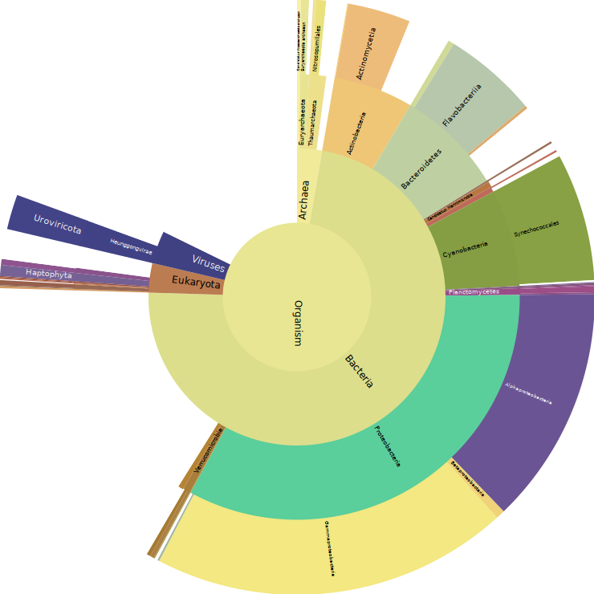
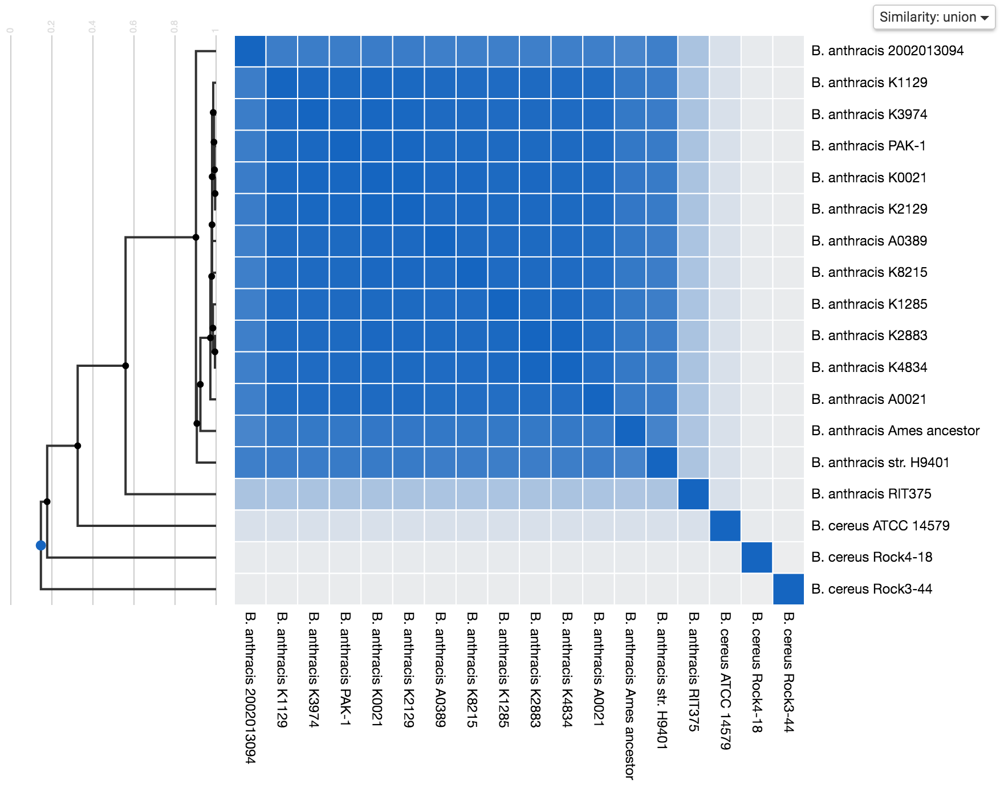

# Primer on Metagenomics

## Classifying Life

Upon hearing the term "Animal Kingdom", you might think of either the
jungle or the stories of Reynard the Fox, where the lion rules over the
other animals as King. Or you might be reminded of any other number of
movies, music albums or television series. Often in such stories, the
comparison is made between human and animals, either assigning animal
traits to humans or featuring anthropomorphic animals.

In evolutionary biology, the term "Animal Kingdom", or rather "Kingdom
Animalia", is a classification; a grouping of organisms. It is not the
only kingdom, but perhaps it is, for us humans, the most important
one, since we are part of it. Fortunately, despite calling it a
kingdom, there's no king we all are fealty to. The other kingdoms are
usually the plants (Plantae), Fungi, Chromista, Protozoa, Archaea and
Bacteria. Why usually? Well, life being life, the borders between these
classifications are a rather gray area and they have been reassigned
often. In fact, the study of naming and classifying groups of organisms
is a whole branch of biology, called taxonomy. Other than discussing
about the number of kingdoms, taxonomists also subdivide kingdoms in
phyla, those in classes, those in orders, and so forth. Each group of
organisms is called a taxon and may contain any number of other taxa.
Kingdom, phyla and class are called taxonomic ranks. In this work, we
use the NCBI taxonomy [@federhen], a taxonomy with 29 named taxonomic
ranks (though at the start of my PhD, it had only 27), but in between
those are many unnamed ranks. It includes viruses as well as living
organisms. The NCBI taxonomy was chosen mostly for practical reasons,
but there are many competing taxonomies such as Species 2000 [@banki]
and Encyclopedia of Life [@parr].

Each taxon is directly contained by only a single other taxon, called
its parent. All taxa together are thus structured in a tree, sometimes
called the tree of life, with the group containing all organisms as
root of the tree. The taxa containing a taxon, all the way up to the
root, are called its ancestors; and all taxa contained within a taxon
are called its descendants. Do note that this does not necessarily imply a certain
organism of which all these organisms descend (in reproductive sense),
just that they are grouped together because they are showing similar
characteristics.

{ width=70% }

One of the interesting ranks of grouping organisms is the species,
near the bottom of the taxonomic tree. Whereas most taxa are assigned
subjectively by experienced taxonomists, a species is often defined as
the largest grouping in which every two organisms (of the appropriate
sexes or mating types) can reproduce, with fertile offspring [@mayden].
Still, this definition does not include organisms which reproduce only
asexually, among others.

The first real taxonomy, by Carl Linnaeus [@linnaeus], introduced the
ranked taxa and a naming system for animal and plant species. It was
based on visible characteristics, such as appearance and behavior. After
the evolutionary theory was published by Charles Darwin [@darwin],
classifications would come to reflect common evolutionary descend. In
general, the closer two organisms are to their shared precursor, the
closer they should be in a taxonomy.

The introduction of microscopic organisms into taxonomies has put a
strain on division by visible characteristics. These organisms are
more easily classified by studying their genetic material, carried by
biopolymers.

## The Central Dogma of Molecular Biology

The most well-known carrier of genetic material is without doubt DNA, or
deoxyribonucleic acid (Figure \ref{fig:dna}). A DNA molecule is a long
polymer, formed by a chain of small pairs of monomers. Each DNA monomer,
called a nucleotide, is composed of the sugar 'deoxyribose', a fixed
phosphate group and one of four nucleobases: cytosine (represented by a
C), guanine (G), adenine (A) and thymine (T). Each nucleobase pairs up
with another (cytosine with guanine and adenine with thymine) to form a
base pair, via a hydrogen bond. On the other side, the deoxyribose and
phosphate group bind respectively with the phosphate group of another
monomer, and the deoxyribose of yet another. As such, together, the
deoxyribose-phosphate alternations form two long strands, which spiral
around each other forming a double helix.

{ width=60% }

Because the deoxyribose and the phosphate group are the same for each
monomer, the genetic information in a single strand can be represented
by the sequence of the 4 bases. Furthermore, because the pairs are
fixed, the second strand can be derived from a representation of the
first. The convention is to write down a DNA strand from the end with a
phosphate group (called the 5'-end) towards the end with a deoxyribose
(called the 3'-end). The representing strand is called the forward
strand, and the redundant strand is called the reverse strand. For
example, the DNA fragment in Figure \ref{fig:dna} would be written as
`ACATGG` (with reverse complement `CCATGT` on the reverse strand).

DNA itself is just an information carrier. To perform functions, parts
of the DNA called genes are generally expressed into proteins. DNA is
called protein-coding (or just coding), or alternatively non-coding,
if it encodes for a protein. Depending on the organism, the fraction
of coding versus non-coding DNA wildly varies (for example, the
pufferfish *Takifugu* has 90% non-coding DNA, while the bladderworm
plant *Utricularia gibba* has only 3% non-coding DNA).

To perform gene expression, the DNA is first transcribed into another
polymer called ribonucleic acid (RNA). An enzyme called RNA polymerase
picks onto either strand and starts processing it in the 3' to
5' direction. For each nucleotide, it attaches the complementary
nucleotide, thus forming a copy of the other strand in 5' to 3'
direction. The only exception is that RNA polymerase couples a uracil
nucleobase (U) with the adenine nucleobases in the DNA strand, instead
of a thymine. As such, the resulting RNA polymer is a copy of the
opposing DNA strand with T replaced by U.

After transcription, the resulting RNA can be translated into yet
another polymer called a polypeptide, which then folds into a protein.
This translation is performed by a ribosome. It scans triplets of
nucleotides in the RNA, called codons, starting at the 5'-end, looking
for a start codon. Then, for each codon up to a stop codon, it attaches
the corresponding amino acid. The translation table, the mapping of the
$4^3$ codons onto amino acids (or stop codons), is not the same for
every organism.

The constructed protein performs certain functions before it degrades.
In this work, we will be using the UniProt Knowledgebase [UniProtKB,
@magrane] as reference database. UniProt, short for the Universal
Protein Resource, is a comprehensive resource for protein sequence and
annotation data. Their UniProtKB contains more than 200 million proteins
not only annotated with an NCBI taxon identifier, but also linked to EC
numbers, GO terms en InterPro entries. These point to information on
functions in respectively the EBI enzyme database [@alcantara], the Gene
Ontology [@ashburner] and the InterPro database [@blum].

This three-form-two-step process is called the central dogma of
molecular biology. Most organisms follow these steps, but for instance
some bacteria blend the transcription and translation into a single step,
and some DNA segments don't translate to proteins but perform their
function as RNA.

## Studying Biopolymers

The complete set of an organism's DNA is called its genome, and studying
genomes is called genomics. Genomics aims at a deeper understanding of
organisms by collecting and annotating all of an organism's genes, and
studying their interrelations and influence on the organism.

A genomics study traditionally consists of three parts: sequencing,
assembly and annotation. The first part, sequencing, is the conversion
of physical DNA molecules into their DNA sequence, the order of the
nucleotides in the chain. Current machinery is incapable of accurately
and rapidly sequencing complete molecules. The DNA molecules are first
split into shorter segments, from which reads are sequenced. These reads
can vary in length from 25 base pairs up to a few 10.000 base pairs,
depending on the used sequencing technology, with various read error
types and rates. The result of sequencing is a data set of the DNA
sequences of reads, along with some metadata such as the quality of a
read.

Since the DNA molecules were segmented into reads, the next step is
assembling the reads again into the complete genome sequence. When the
sequenced DNA sequence is of an organism closely related to an organism
with a known genome, comparative assembly (read mapping) can be used.
The sequenced reads are mapped onto the reference sequence to form the
new sequence. When there's no reference genome, *de novo* assembly is
used. In *de novo* assembly, an attempt is made to form the complete
genome by overlapping the short reads. As reference, the average fruit
fly, human and SARS-CoV-2 genomes are respectively 139.991 Mbp ($10^6$
base pairs), 2864.1 Mbp and 29882 bp long.

Finally the assembled sequence is annotated. Coding and non-coding
parts are identified, the genes in the coding parts are predicted, the
functions of the genes are analyzed, among other annotations. These
steps are performed manually and automatically (called *in silico*), or
a mixture of both.

Similar to a genome, the collection of an organism's proteins is
called its proteome, with the corresponding study called proteomics.
Since a protein performs a function, studying the proteome of an
organism provides insight in what this organism can do. Large scale
proteomics studies may follow the same pattern as genomics studies: the
proteins are segmented, often with trypsin. The protein sequence of
these segments, called (tryptic) peptides, is then determined by for
example comparing the measured mass spectrum to a set of predicted mass
spectra. However, since tryptic peptides do not overlap, assembly is not
possible.

Finally, the set of an organism's RNA transcripts is called its
transcriptome, and the corresponding study is called transcriptomics.
The study of a transcriptome provides similar insights to a proteomics
study.

All of these studies are performed on individual organisms. Studying
the genomes, proteomes and transcriptomes of all organisms found in
an environment sample are called metagenomics, metaproteomics and
metatranscriptomics.

In metagenomics, rather than sequencing isolated organisms from
cultivated samples, the DNA is extracted directly from environmental
samples. This has several advantages. First, the cultivation of samples
takes time. Second, cultivation may skew the relative abundance of
organisms in the sample. When extracting DNA without cultivation, the
relative abundance of taxa in the data set is more representative
for the relative abundance of organisms in the sample. This allows
comparative studies of environments over time or location [@metabias].
Third, many organisms cannot currently be cultivated, and as such cannot
be sequenced in genomics [@locey;@rappe;@hugenholtz1998;@hoferthemi].

## Targeted versus Shotgun Metagenomics

<!-- TODO Bart: geen referenties, en ook hier mis ik een beetje het doel. Waarom doen we dit?
* metagenomics verantwoorden
* want eiwitten zijn geconserveerder dan coding regions?
* waarom 16S versus shotgun - wanneer kies je welk (herhaling uit inleiding artikel?)
  - nadeel 16S: horizontal gene transfer (16S makkelijk overgezet omdat het kort is)
  - voordeel shotgun: potentieel meer informatie
  - nadeel shotgun:
    - bij ons: enkel coding -> eiwitten geconserveerder
  - voordeel 16S: primers overal dezelfde, dus ook nuttig voor metagenomics
-->

Early metagenomics methods were based on (partial) 16S ribosomal RNA
sequences. These short sequences occur in all prokaryote cells, and
contain both highly conservative (rarely mutating) regions and often
mutating regions. The conserved regions can be used as primers (markers)
to sequence the 16S rRNA. While this serves to identify prokaryote
species in a sample, it does not help to assemble complete genomes, nor
does this work on eukaryotes.

The more recent shotgun metagenomics, on the other hand, uses sequencers
yielding randomly located short reads from the complete environmental
sample. To provide sufficiently complete coverage to allow assembly
of all organisms in the sample, much larger data sets are required
compared to genomics (3.3 million genes from 567.7 Gbp sequence data
for the human gut microbiome gene catalog). The amount of data and the
repetitions of DNA within and between (allowing the incorrect assembly
of chimeras) organisms make assembly a hard problem to solve.

To simplify assembly, reads are partitioned and assigned to an individual
genome. This process is called binning. Afterwards, each bin can be
assembled as if the reads resulted from a genomics sample. Most binning
methods work by comparing DNA properties of reads, such as CG-content
(the ratio of C- or G-nucleotides to A- and T- nucleotides), to the
properties of known genomes.

## Unipept

Unipept is a set of tools for biodiversity and functional analysis
of metaproteomics data sets. It was originally made available as
a web application with a focus on interactive data visualizations
[@mesuere2012;@mesuere2015]. It offers three services.

The **tryptic peptide analysis** service is used to gather information
about a single tryptic peptide. It searches for the proteins this
peptide occurs in and shows the taxonomic lineage for each of these
proteins in a table (Figure \ref{fig:unipept:tpa}). It also reports the
lowest common ancestor taxon (LCA) of all these proteins based on this
lineage table. Finally, since functional annotations were also added
to Unipept [@gurdeep], the tryptic peptide analysis service also lists
the GO terms, EC numbers and InterPro entries linked to the matching
proteins.

The **metaproteome analysis** service applies the tryptic peptide
analysis to a list of tryptic peptides extracted from a sample. For
each peptide, it calculates the lineage-based LCA and the lists of
functional annotations linked to the matching proteins. The LCAs are
visualized in sunbursts, tree maps, heat maps and other interactive
visualizations, giving insight in the biodiversity of the sample (Figure
\ref{fig:unipept:ma}). The lists of functional annotations are added
together and also reported.

Finally, the **peptidome analysis** service offers information about the
complete set of (tryptic) peptides encoded in the proteome of one or
multiple organisms [@peptidome]. The unique peptide finder is an aid
for targeted proteomics. It searches for the disjoint sets of tryptic
peptides that are unique to an single proteome within a list of selected
proteomes. These disjoint sets can then be used as markers for targeted
proteomics experiments. The peptidome clustering, on the other hand,
searches for similarities between the proteomes of, again, a list of
selected organisms. This makes it a very useful tool to, for instance,
detect misclassifications in a taxonomy (Figure \ref{fig:unipept:pa}).

Where Unipept started out as a web application, a platform chosen
for its ease of access and user friendliness, the ecosystem has been
extended over the years. An API was added for machine interactions
with Unipept [@unipeptapi]. This has allowed for integration in other
services such as Galaxy [@galaxy] and the development of a command
line interface (CLI) for power users. Furthermore, the web application
was rewritten to be more portable, leading to the release of a desktop
client [@verschaffelt2021] that largely shares the same code base as
the web application, but also supports the use of custom reference
databases.

Running a service such a Unipept as a web application is only
possible due to a thoughtfully designed database with proper indexing
and the caching of relevant data. In fact, the lowest common
ancestor of all known tryptic peptides and the lists of functional
annotations are precomputed and stored in the database. This is
achieved by preprocessing all proteins in the UniProtKB after it
is released. More details on this process can be found in section
\ref{section:makedatabase}.

## Metagenomics via Metaproteomics

Given the success of Unipept for metaproteomics, could we reuse the
peptide-to-taxa mapping for metagenomics as well? By using a gene
predictor, a metagenomics data set can be transformed *in silico* to a
metaproteomics data set. As metagenomics data sets are of much larger
volume than metaproteomics data sets, the Unipept index is wrapped in a
local command line tool to avoid the network bottlenecks of an online
tool. Thus the Unipept Metagenomics Analysis Pipeline is born, as an
experiment to perform a metagenomics biodiversity analysis by making a
detour through a general purpose metaproteomics database.

In chapter \ref{chapter:umgap}, we describe the complete pipeline
and evaluate it as an alternative method of metagenomics analysis.
An index operating on fixed-length overlapping peptides is
introduced as alternative for the tryptic peptide index. In chapter
\ref{chapter:fgsrs}, we introduce a new implementation of FragGeneScan,
to be used as an improved gene predictor in the pipeline. In chapter
\ref{chapter:on-the-side}, we include some of the metawork on the
pipeline, such as the improved construction of the Unipept (and UMGAP)
index and a few walkthroughs describing the usage of UMGAP in other
studies.
