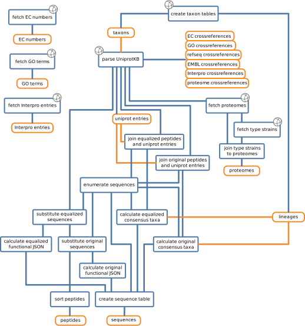

## Constructing the Database {#section:makedatabase}

The core components of Unipept and the UMGAP both depend on a mapping of
peptides to taxonomic identifiers. To construct such a mapping, and to
have it be generic enough to recognize a wide variety of peptides, it
needs to be based on a vast amount of data. The UniProt Knowledgebase
[@magrane], the central hub for functional annotation on proteins, its
cross references, and the NCBI taxonomy [@federhen] are used for this
purpose.

<!-- TODO
- hoe lang het duurt om de DB/index op te bouwen; aangeven dat hier in de loop der tijd veel performane improvements geweest zijn; hoeveel onderhuodt kruipt hierin
- hoe frequent worden de databanken/indexes geupdate; vraagt die nog manueel werk of volledig geautomatiseerd?
- nood aan regelmatige builds omschrijven
-->

The code to construct the database is publicly available on
[GitHub](https://github.com/unipept/make-database).

### Extracting the Unipept Database

To build a performant application, the data from the UniProtKB
is parsed, extracted, preprocessed and stored in a relational
database. This database is then queried by the Unipept web application
[@mesuere2012] and, more recently, the Unipept Desktop Client
[@verschaffelt2021].



Figure \ref{fig:makeflow} describes the flow of data from our online
sources to the final database tables. On the left, independent from the
rest of the flow, the EC numbers, GO terms and InterPro entries are
downloaded from respectively the EBI enzyme database [@alcantara], the
Gene Ontology [@ashburner]and EBI InterPro database [@blum].

On the right, the flow starts with downloading the NCBI taxonomy
and process it in the **create taxon tables** function to create
the *taxons* table and the *lineages* table. The first contains the
NCBI taxon ID, its name, its rank, the taxon ID of its parent and
whether it's valid. The validity of a taxon is used to eliminate some
unwanted taxa from calculations while keeping them in the database for
completeness [@mesuere2012]. The latter contains for each taxon its
precalculated lineage, by traveling to the root taxon via parentage, on
fixed ranks. This table speeds up the lineage queries on the webserver
and the lowest common ancestor calculations.

In **parse UniProtKB**, the XML formatted UniProtKB is downloaded and
parsed. The *uniprot entries* are saved in a table with the taxon ID of
the organism the protein was extracted from and the protein sequence.
It outputs the EC, GO, RefSeq [@oleary], EMBL [@lopez], InterPro and
proteome [@nightingale] annotations to their respective cross references
tables and saves all encountered tryptic peptides in the *peptides*
table and proteomes for further processing. A *proteomes* table is
created with additional downloaded data, but it is not used in the
UMGAP.

In **join equalized peptides and uniprot entries** and **join original
peptides and uniprot entries**, the encountered tryptic peptide
sequences (whether or not the leucine amino acids have been replaced
with isoleucine, since they are indistinguishable to spectrometers)
are recombined with the taxon ID annotated on their entry. All unique
peptides, whether equalized or original, are given numeric IDs in
**enumerate sequences**. These numeric IDs replace the actual sequences
in the peptides table in **substitute equalized sequences** and
**substitute original sequences** to form the final peptides table.
Functional annotations, not used in the UMGAP, are also extracted
from the peptides in the **calculate equalized functional JSON**
and **calculate original functional JSON** steps to be added to the
*sequences* table.

The amino acid sequences are also replaced with their numeric IDs in
the equalized peptide/taxon and original peptide/taxon pairs as first
steps in **calculate equalized consensus taxa** and **calculate original
consensus taxa**. All taxa paired with the same sequence are then
aggregated using a lineage-based lowest common ancestor method. The
results are brought together in **create sequence table** resulting in
the *sequences* table.

### Creating a UMGAP Index

From this complete database, only a three tables are of interest to the
UMGAP tool. First, as the UMGAP is a taxonomic identification tool,
is the processed NCBI taxonomy *taxons*. Second is the *sequences*
table, which contains the mapping of tryptic peptides onto their lowest
common ancestor. Third is the *uniprot entries* table, which contains
among other columns the protein sequence and the assigned taxon of the
original UniProt entry. The latter is used for the construction of the
*k*-mer-to-taxon mapping.

While querying a relational database is fast enough for a metaproteomics
tool, it does not suffice for a metagenomics tool, which is expected
to handle much larger amounts of data. This is especially true for the
*k*-mer-to-taxon mapping, the construction of which is too slow for the
Java code used for the tryptic peptide mapping.

Three additional tools were developed to construct an index file for the
`umgap pept2lca` tool, with an extra one for debugging. The first tool
is the `umgap splitkmers` command, which takes tab-separated taxon IDs
and protein sequences and outputs all *k*-mers in each protein sequence
alongside the taxon ID. The second tool is the `umgap joinkmers` tool,
which consumes an alphabetically sorted stream of peptides alongside
taxon IDs, and outputs each peptide once, together with a taxon ID
aggregated from all taxon IDs found together with this peptide. Between
the second and first tools, the GNU sort command groups together the
peptides. Finally, the `umgap buildindex` command builds a single
compressed index file which is then used by the `umgap pept2lca` tool.
The `umgap printindex` tool decompresses such an index file back to the
input of `buildindex` for debugging purposes.

#### The `splitkmers` Command

The input is given on standard input and should be a TSV formatted
stream of taxon IDs and a protein sequence from this taxon. The output
will be written to standard output and consists of a TSV formatted
stream of *k*-mers mapped to the taxa in which they occur. The *k*-mer
length is configurable with the `-k` option, and is 9 by default.

```shell
$ cat input.tsv
654924  MNAKYDTDQGVGRMLFLGTIGLAVVVGGLMAYGYYYDGKTPSSGTSFHT...
176652  MIKLFCVLAAFISINSACQSSHQQREEFTVATYHSSSICTTYCYSNCVV...
$ umgap splitkmers < input.tsv
MNAKYDTDQ  654924
NAKYDTDQG  654924
AKYDTDQGV  654924
KYDTDQGVG  654924
YDTDQGVGR  654924
...
SPSFSSRYR  654924
PSFSSRYRY  654924
MIKLFCVLA  176652
IKLFCVLAA  176652
KLFCVLAAF  176652
...
```

##### Options & Flags {#opts-splitkmers}

`-h / --help`
  ~ Prints help information

`-V / --version`
  ~ Prints version information

`-k / --length k`
  ~ The k-mer length [default: 9]

`-p / --prefix p`
  ~ Print only the $(k-1)$-mer suffixes of the *k*-mers starting with
    this character

#### The `joinkmers` Command

The `umgap joinkmers` command takes tab-separated peptides and taxon
IDs, aggregates the taxon IDs where consecutive peptides are equal and
outputs a tab-separated triple of peptide, consensus taxon ID and taxon
rank.

The input is given on standard input. If it is sorted on the first
column, a complete mapping from strings to aggregated taxa and its rank
will be written to standard output.

The aggregation strategy used in this command to find a consensus taxon
is the hybrid approach of the `umgap taxa2agg` command, with a 95%
factor. This keeps the result close to the lowest common ancestor, but
filters out some outlying taxa.

The taxonomy to be used is passed as an argument to this command. This
is a preprocessed version of the NCBI taxonomy.

```shell
$ cat input.tsv
AAAAA   34924
AAAAA   30423
AAAAA   5678
BBBBBB  48890
BBBBBB  156563
$ umgap joinkmers taxons.tsv < input.tsv
AAAAA   2759  superkingdom
BBBBBB  9153  family
```

##### Options & Flags {#opts-joinkmers}

`-h / --help`
  ~ Prints help information

`-V / --version`
  ~ Prints version information

#### The `buildindex` Command

The `umgap buildindex` command takes tab-separated strings and taxon
IDs, and creates a finite state transducer (FST) of this mapping.

The input is given on standard input. It should be in a TSV format with
two columns, ordered by the first. The unique strings in the first
column should be mapped to the integers (taxon IDs) in the second
column. A binary file with a compressed mapping is written to standard
output.

<!-- TODO describe the index mechanism -->

```shell
$ cat input.tsv
AAAAA   2759
BBBBBB  9153
$ umgap buildindex < input.tsv > tiny.index
$ umgap printindex tiny.index
AAAAA   2759
BBBBBB  9153
```

##### Options & Flags

`-h / --help`
  ~ Prints help information

`-V / --version`
  ~ Prints version information

#### The `printindex` Command

Outputs in the string keys and taxon ID values in TSV format, mostly for
debugging purposes.

```shell
$ umgap printindex tryptic.index
...
AAAAADRPANEIGGR       293089
AAAAADRPAPAGHDHQAVAR  156981
AAAAADRPASQIVR        536018
AAAAADRPE             1707
AAAAADRPEVHALALR      1883427
AAAAADRPFVAEPAR       41275
AAAAADRPIAAHAEDESLVR  33010
AAAAADRPIR            1988
AAAAADRPLAEHGGPVPR    1827
...
```

##### Options & flags {#opts-printindex}

`-h / --help`
  ~ Prints help information

`-V / --version`
  ~ Prints version information
