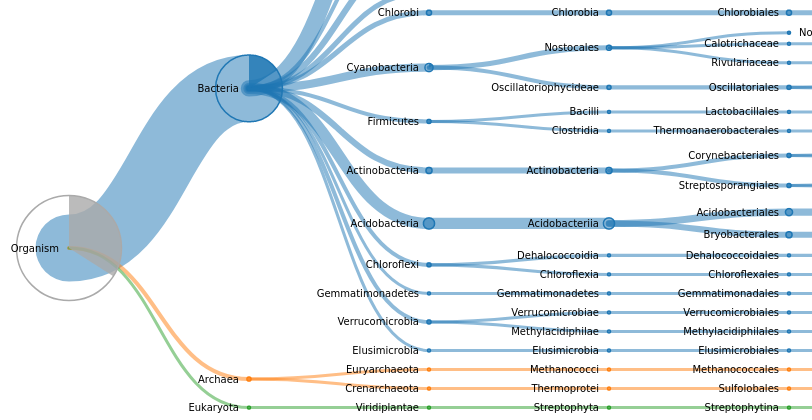
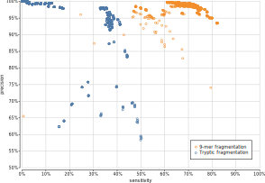
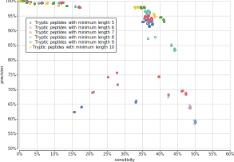
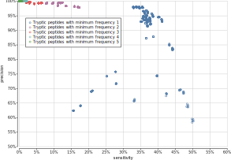
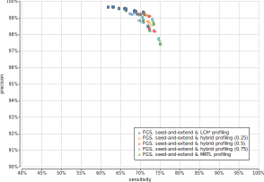
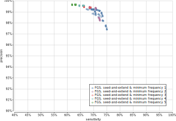
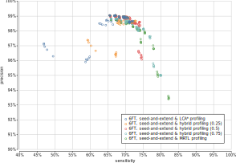
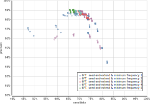

## Context and results
\label{section:umgap}

### Introduction {#introduction-umgap}

Biodiversity, in many environments, is formed by complex communities of
archaea, bacteria, eukaryotes, and viruses. Most of these organisms are
hard to isolate and culture in lab conditions, so getting insight into
which species are present in these environments and estimating their
abundances nowadays routinely relies on metagenomics [@hugenholtz]:
a combination of high-throughput DNA sequencing and computational
methods that bypass the cultivation step to enable genomic analysis. In
particular, shotgun metagenomics, the non-targeted sequencing of all
genomes in an environmental sample, is applied more often [@quince], as
it allows the profiling of both taxonomic composition and functional
potential of the sample.

In general, computational approaches for taxonomic profiling of
metagenomics data from high-complexity environments directly process
the reads by either assembling them into larger contigs before
profiling [@peng2011;@namiki;@peng2012;@simpson;@boisvert;@pell]
or by individually mapping them to DNA sequence databases
[@huson;@brady;@wood2014], e.g., compiled from publicly available
reference genomes. As the latter approach is carried out without
assembly, it can mitigate assembly problems, speed up computations, and
enable profiling of low-abundance organisms that cannot be assembled
de novo [@quince]. Mapping a read onto a reference database usually
either applies inexact string matching algorithms on the entire read or
breaks it into shorter fragments before applying exact string matching
algorithms.

In this paper we explore the alternative route of first translating the
protein coding regions in the reads of a shotgun metagenomics data set.
We then map the resulting protein fragments onto a reference protein
sequence database. Because protein sequences are more conserved than
the genes encoding them [@watson], this might alleviate the limitation
that environmental samples contain strains that are not covered in
reference databases or even belong to yet uncharacterized species. In
addition, it allows us to adapt the high-performance mapping algorithms
based on periodic builds of a UniProtKB-based index [@boeckmann] for
mapping tryptic peptides that we developed for shotgun metaproteomics
analysis in Unipept [@mesuere2012;@gurdeep;@mesuere2015;@verschaffelt].
Mapping against the complete UniProt Knowledgebase has the advantage
that it covers all domains of life in a single general-purpose analysis,
compared to using one or more reference databases of selected genomes.

The general steps involved in our approach for taxonomic profiling of
a DNA read are outlined in Figure \ref{outline}. After identifying and
translating the (partial) protein coding genes in the read, the protein
fragments are split into short peptides. Each individual peptide is then
mapped onto a precomputed consensus taxon derived from all proteins
containing the peptide in the reference database. As a final step we
derive a consensus taxon for the read from the consensus taxa of its
individual peptides. For paired-end sequencing, the information content
in the final step increases after merging the individual peptides from a
read pair, as it is guaranteed that both reads originate from the same
organism.

{ width=75% }

Each individual step in the above process can be tackled using a
multitude of strategies. To explore which strategy performs best and how
the combination of alternative strategies leads to different trade-offs
with respect to runtime, memory footprint and predictive accuracy, we
have implemented the Unipept Metagenomics Analysis Pipeline (UMGAP)
according to the Unix philosophy [@raymond]. The result is a modular
suite of 20 versatile filters (commands that read from standard input
and write to standard output) that each implement a single operation and
that can be seamlessly combined into a single data processing pipeline.
All filters are implemented in [Rust](https://www.rust-lang.org)
and support parallelization to achieve optimal performance. As some
filters implement alternative strategies of the same operation, we
have performed a parameter sweep to collect performance metrics
of all relevant combinations of alternative strategies. Based on
our observations from this parameter sweep, we have selected six
preconfigured pipelines with different performance trade-offs whose
results have been compared in an established benchmark [@lindgreen] to a
selection of state-of-the-art shotgun metagenomics taxonomic profiling
tools.

UMGAP has been open sourced on [GitHub][] under the MIT License.
[Documentation][] and [case studies][] are available on the Unipept
website.

[GitHub]: https://github.com/unipept/umgap
[Documentation]: https://unipept.ugent.be/umgap
[case studies]: https://unipept.ugent.be/umgap/casestudies
 
### Methods

UMGAP performs taxonomic profiling of individual reads or read pairs
in a shotgun metagenomics data set. Results can be summarized for the
entire data set, either as a hierarchical frequency table containing
each identified taxon or as an interactive taxonomic visualization. The
pipeline executes a multi-step process and provides fast implementations
of alternative strategies for every step of the analysis. In this
section, we chronologically discuss the successive steps of the generic
pipeline, together with their alternative strategies.

#### Protein translation

UMGAP does not profile a read directly at the DNA level. Instead,
protein fragments translated from the coding regions in the read are
matched. Non-coding regions are ignored *a priori* (which might impact
the sensitivity compared to identification strategies that use the
entire read) and extra steps are required to find coding regions and
protein translations (which might negatively impact both performance
and accuracy). However, the more conserved nature of proteins compared
to DNA might lead to better generalizations when it comes to profiling
environmental strains that have no perfect match in the reference
database [@watson]. Two approaches are supported: one based on gene
prediction in short reads and one based on a full six-frame translation
(Figure \ref{protein-translation}).

![Sample DNA fragment extracted from the *Acinetobacter baumannii* 118362 genome (NCBI Assembly ASM58051v1, positions 37.700-39.530) containing three RefSeq annotated coding regions of a major Facilitator Superfamily protein (EXA88265), a tetR family protein (EXA88191) and a translocator family protein (EXA88255), marked with yellow lines (top). Blue lines indicate coding regions predicted by FGS. Green dots indicate starting positions of 9-mers with an LCA\* on the *A. baumannii* lineage (true positive identifications). Red dots indicate starting positions of 9-mers with an LCA\* outside the *A. baumannii* lineage (false positive identifications). Opacity of colored dots indicates depth in the taxonomic tree: opaque colors indicate highly specific LCA\* (species level) and translucent colors indicate nonspecific LCA\*. This example illustrates the following general observations: (1) the frameshift-correcting topology of the FGS hidden Markov model often incorrectly interprets coding regions of genes that are very close or overlapping as frameshifts and glues them together; (2) missing dots at the end of coding regions is merely an artifact of the visualization: the last 8 codons (24 bases) are never starting positions of $k$-mers; (3) FGS may identify false coding regions or (4) frame shifts, but the extracted peptides from those and (5) translations from non-coding regions in a six-frame translation are mostly filtered automatically as they have no exact match with any UniProt protein or can be filtered with additional heuristics.\label{protein-translation}](figures/6ft-figure/final.svg){ width=90% }

##### Gene prediction

In theory, UMGAP may use any gene predictor capable of identifying
coding regions and their translations in short reads. Not all gene
predictors can do this task accurately, as reads might contain only
partial coding regions with start and/or stop sections missing. The
translation table to be used is also *a priori* unknown.

We used both FragGeneScan (FGS) [@rho] and [FragGeneScan++][] (FGS++)
for testing and benchmarking purposes. FGS has a custom Hidden Markov
Model whose topology especially addresses the problem of finding genes
in short and error-prone reads, correcting frameshifts resulting from
read errors. FragGeneScan-Plus (FGS+) [@kim] is a faster implementation
of FGS. As FGS+ is no longer actively supported, our own implementation
with improved multithreading support and several critical bug fixes has
been released as FGS++.

[FragGeneScan++]: https://github.com/unipept/FragGeneScanPlusPlus

FGS and its derivatives are functionally equivalent and can thus be
plugged into UMGAP interchangeably. They perform gene prediction
relatively fast and accurate. However due to their predictive nature,
false negatives and, to a lesser extent, false positives might have a
negative impact on downstream steps of the pipeline. Especially missed
coding regions may lead to information loss and reduced precision of the
pipeline.

##### Six-frame translation

Translation of all coding regions is guaranteed when applied on
all six reading frames of an error-free read, but at least 83.33%
false positives (5 out of 6 reading frames) need to be filtered away
downstream. UMGAP implements this strategy without attempting to correct
for read errors at this stage, as they only result in local information
loss in downstream steps. The translation table is user-specified,
without an attempt to derive it from the data or using multiple tables.
While this approach might lead to increased sensitivity compared to gene
prediction, it yields at least a sixfold increase in the data volume
that needs to be processed in downstream analysis.

#### Protein fragmentation

All (partial) proteins that are putatively translated from the read are
matched against the complete UniProt Knowledgebase [@kim;@magrane].
Direct full-length exact matching is not feasible due to natural
variation and read errors. Even though fast heuristics exist for
full-length inexact matching or alignment [@altschul], it remains a
relatively slow approach. Instead, UMGAP achieves high-performance
inexact matching of protein fragments by breaking them down into short
peptides. Two approaches are supported: non-overlapping variable-length
peptides and overlapping fixed-length peptides.

##### Tryptic peptides

UMGAP breaks protein fragments into non-overlapping variable-length
peptides by splitting after each lysine (K) or arginine (R) residue
that is not followed by proline (P). This is the classic *in silico*
emulation of a trypsin digest, the most widespread protein digestion
used for mass spectrometry [@vandermarliere]. It is a random
fragmentation strategy in the context of metagenomics, but finds its
roots in the Unipept metaproteomics analysis pipeline as the initial
starting point for UMGAP, and is merely an attempt to reuse part of the
metaproteomics processing pipeline for metagenomics analysis. Applying
this fragmentation strategy to all proteins in the UniProt Knowledgebase
(2020/04 release) yields a collection of tryptic peptides with an
average length of 17.671 amino acids (with peptides shorter than 5 or
longer than 50 discarded).

##### $K$-mers

With overlapping fixed-length peptides or $k$-mers, the only parameter
is the length $k$ of the peptides. Choosing smaller $k$ leads to more
spurious hits when matching the $k$-mers of a protein fragment against
the $k$-mers inferred from a reference protein database. Choosing
larger $k$ increases the impact of natural variation and read errors.
Because protein fragments are reduced to all their overlapping $k$-mers,
the number of resulting peptides increases $k$-fold compared to using
tryptic peptides. So, choosing larger $k$ also increases the total
length of all peptides and thus the memory footprint for indexing
them. It also increases the number of lookups that need to be done
during peptide profiling. Finding a well-balanced peptide length $k$ is
therefore crucial.

Because UMGAP uses exact matching for mapping peptides derived
from a read onto peptides derived from the proteins in a reference
database, read errors and natural variation usually have a lower
impact on $k$-mers than on tryptic peptides. This is illustrated in
Figure \ref{snp-impact} for a single nucleotide polymorphism (either as
a read error or a natural variation).

![Impact of a single nucleotide polymorphism (SNP) on the peptide coverage of a protein fragment. Because tryptic peptides are non-overlapping, each read position is covered by exactly one tryptic peptide. A SNP modifies a single tryptic peptide, but all positions around the SNP covered by the modified peptide are no longer covered (correctly) after matching (53 read positions on average). Because $k$-mers are overlapping, each read position is covered by k peptides, except at the ends of the protein fragments. A SNP modifies k peptides, but apart from reduced peptide coverage around the SNP, only a single codon is no longer covered (correctly) after matching. The redundancy of the overlapping $k$-mers therefore makes up for a reduced impact of SNPs compared to non-overlapping tryptic peptides, at the cost of larger data volumes that need to be processed.\label{snp-impact}](figures/kmer-vs-tryptic/figure.svg){ width=75% }

#### Peptide profiling

Fragmentation of all partial proteins found in a read yields a list
of peptides (tryptic peptides or $k$-mers). Each peptide may have an
associated consensus taxon that is looked up in an index structure.
Overall, these lookups are the most time-consuming step in the pipeline,
so performance is of utmost importance.

Upon each UniProt release, the Unipept team builds and publishes new
indexes from tryptic peptides and 9-mers extracted from all UniProt
proteins in the Knowledgebase (available online). Each of these peptides
is associated with the LCA\* consensus taxon computed from the set of
taxonomic annotations on all UniProt proteins that exactly match the
peptide [@mesuere2012]. LCA\* is the most specific taxon that does
not contradict any taxon in the set, i.e., all taxa in the set must
either be descendants or ancestors of the LCA\* in the NCBI Taxonomy
[@federhen]. See the read profiling step for a detailed discussion on
the LCA\* algorithm introduced by UMGAP as a variation on the lowest
common ancestor (LCA) algorithm.

UMGAP uses a finite state transducer [@gallant] as its index structure
to lookup the LCA\* consensus taxon for each peptide extracted from
a read. This index structure supports high-performance and parallel
lookups, supports both fixed and variable length peptides, and has a
relatively small memory footprint. The latter is important, given the
large number of peptides extracted from UniProt. The index should be
loaded in process memory, but UMGAP can also operate with an on-disk
index and very little memory at the cost of performance.

The FST maps each peptide extracted from a UniProt protein to the
NCBI Taxonomy Identifier (an integer) of the LCA\* associated with
the peptide. It is a flow graph whose edges are labeled with amino
acids and integers. Peptides are matched by following the path of
their amino acid sequence. The sum of the integers along this path
corresponds the identifier of the LCA\*. Where tries are ordered tree
data structures that take advantage of common prefixes to reduce the
memory footprint, FSTs are even more compressed by taking both common
prefixes and suffixes into account (Figure \ref{fst}).

{ width=75% }

For UniProt release 2020-04, a 19.3 GiB FST-index maps all 1.2 billion
tryptic peptides to their LCA\* and a 132.9 GiB FST-index maps all
17 billion 9-mers to their LCA\*. We also experimented with other
$k$-mer lengths, but precision dropped significantly for $k \le 7$
(Figure \ref{peptide-length}) and the index size became too large for
$k \geq 10$. The only viable options were $k = 8$ and $k = 9$, with the
latter giving the best balance between index size and accuracy of read
profiling.

![All tryptic peptides found in the UniProtKB (release 2020-04-22), classified by length and associated LCA\* rank. Fractions of peptides (y-axis) across all peptide lengths (left) or per peptide length (right). Short tryptic peptides are more frequently associated with less specific ranks in the NCBI Taxonomy and therefore have a lower information content. Relative taxonomic information content (depth of LCA\* rank in tree of life) is low for short peptides (length 8 and below). Because tryptic peptides of length $k$ are a random sample of all $k$-mers, similar ratios and conclusions are expected should this analysis be repeated for all $k$-mers in UniProtKB across all lengths $k$.\label{peptide-length}](figures/rank-accuracy/figure.svg){ width=90% }

#### Peptide filtering

Protein fragmentation may yield false positives: peptides that do
not occur in proteins encoded in the read. Most false positives
are automatically filtered as they have no exact match with any
UniProt protein. As a result, they cannot be associated with a taxon
during peptide profiling. This is the case for most peptides from
translations of wrong gene predictions or outside coding regions in a
six-frame translation (Figure \ref{protein-translation}). But peptide
profiling itself may also yield false positive identifications: peptides
associated with an inconsistent taxon, i.e., a taxon that is not the
correct taxon or one of its ancestors in the NCBI Taxonomy tree. This
could be the case for both true and false positive peptides from protein
fragmentation. Peptide filtering aims at strongly reducing the number of
false positive identifications, while keeping most true positives. UMGAP
supports three kinds of filters.

##### Short tryptic peptides

Analysis on UniProt proteins shows that short tryptic peptides are
typically associated with highly unspecific LCA\* consensus taxa, i.e.,
taxa at or close to the root of the NCBI Taxonomy tree [@mesuere2012]
(Figure \ref{peptide-length}). Because these peptides match proteins
occurring across all domains of life, they do not provide a strong
taxonomic signal that could be useful in downstream steps of the
pipeline. In addition, by being short they often cause spurious matches
during peptide profiling. UMGAP can skip very short tryptic peptides,
e.g., having less than 6 amino acids.

##### Low-frequency identifications

In the context of peptide profiling, true positive identifications
should come from the same lineage in the NCBI Taxonomy tree, whereas
false positives are randomly scattered across the tree. Since one
read typically yields many peptides that may each have an associated
taxon, identifications along the correct lineage are expected to
occur with high frequency and false positives are expected to occur
with low frequency. Therefore UMGAP can skip peptides associated with
low-frequency identifications.

##### Seed-and-extend.

The (partial) proteins in the read are typically fragmented into
multiple peptides and it is expected that neighboring peptides have
similar identifications (Figure \ref{protein-translation}). It therefore
seems natural to use a seed-and-extend approach to exploit this expected
local conservation of identifications. Peptides are first scanned to
find seeds: $s$ or more successive peptides that are associated to the
same LCA\*. With increased minimum seed size $s$, the precision of
the pipeline will increase, and its sensitivity will decrease. Each
seed is then extended in both directions to neighboring seeds and
individual peptides that are bridged by gaps (successive peptides with
no associated LCA\*) of at most $g$ peptides. With increased maximum
gap size $g$, the precision of the pipeline will decrease, and its
sensitivity will increase. UMGAP can skip peptides that are excluded
from extended seeds (Figure \ref{seed-extend}).

![Seed-and-extend strategy for filtering false positive identifications after peptide profiling, with minimum seed size $s=3$ and maximum gap size $g=1$. Successive peptides fragmented from (partial) protein are shown as a sequence of dots. Green dots indicate correct identifications (true positives). Red dots indicate wrong identifications (false positives). Brightness of colored dots indicates depth in the taxonomic tree: dark colors indicate highly specific LCA\* (species level) and light colors indicate nonspecific LCA\*. Grey dots indicate peptides without an associated LCA\*.\label{seed-extend}](figures/seed-extend/figure.svg){ width=75% }

<!-- TODO afbeelding op volledige breedte (overal eigenlijk) -->

#### Read profiling

Previous steps of the pipeline result in a list of taxonomic
identifications, derived from a (filtered) list of peptides extracted
from the read. As the read comes from a single organism, it is natural
to aggregate these individual identifications that rely on partial
data into one global consensus identification. UMGAP supports three
heuristics that infer a consensus taxon after mapping a frequency table
of the individual identifications onto the NCBI Taxonomy tree (Figure
\ref{consensus-tree}). They balance between providing a consensus taxon
that is as far away from the root as possible and that allows for a
good generalization. The first goal is progressive and leads to a very
specific consensus but has to avoid overfitting. The second goal is
conservative and takes into account the possibility of false positives
among the individual identifications but has to avoid underfitting.
All heuristics are implemented with two different data structures: a
tree and a range minimum query [@fischer]. Both implementations are
functionally equivalent, but the latter gives a faster implementation of
the MRTL heuristic because querying ancestry is supported in constant
time.

![Lowest common ancestor (LCA), LCA\*, hybrid$_f$ and maximum root-to-leaf (MRTL) are four heuristics that determine a consensus taxon for a given list of taxa. All heuristics map the list of taxa onto the NCBI Taxonomy tree, that guides the heuristic towards a consensus taxon. MRTL is the most progressive heuristic and LCA\* is the most conservative heuristic, so the MRTL consensus will be deeper in the tree than the LCA\* consensus. The hybrid$_f$ heuristic has a parameter $f$ that can be tweaked to yield a result that is either more towards the LCA\* consensus or the MRTL consensus.\label{consensus-tree}](figures/consensus-tree/figure.svg){ width=50% }

##### MRTL

Maximum root-to-leaf [@wood2014] is the most progressive heuristic. It
identifies the consensus among a list of taxa as a taxon having the
maximal number of ancestors in the list. Ties are broken arbitrarily. By
definition, the consensus taxon is always included in the original list
of taxa. This property does not hold for the other two heuristics, and
shows that this heuristic might not necessarily be good at generalizing.

##### LCA\*

This is the most conservative heuristic, though less conservative than
a standard lowest common ancestor (LCA). For a given list of taxa, it
identifies the consensus taxon as the most specific taxon in the tree
that is either an ancestor or a descendant of each taxon in the list.
This is the LCA of all taxa in the list, after we have first discarded
all ancestors of at least one other taxon in the list. The latter is a
measure against underfitting. Because the individual identifications are
only based on partial data, it is expected that some identifications
might be more specific than others. The LCA\* heuristic is also used to
compute the consensus taxon during peptide profiling.

##### Hybrid$_f$

This heuristic has a parameter $f \in [0,1]$ that allows to balance
between being conservative or progressive: with $f = 1$ this heuristic
is the same as LCA\* and with $f = 0$ this heuristic is very close to
MRTL (the same for most lists of taxa). LCA\* can be implemented by
starting at the root of the tree and repeatedly descending to the child
node whose subtree contains all taxa in the list, until such a child no
longer exists (i.e., the taxa in the list are distributed over multiple
subtrees). In the latter case, the hybrid heuristic continues descending
to the child node whose subtree contains most taxa from the list (with
ties broken arbitrarily) if the fraction of the number of descendants
in the child node over the number of descendants in the current node is
larger than or equal to $f$.

#### Summary and visualization

Previous steps assign a consensus taxon to each read (pair). The final
step of the pipeline computes a frequency table of all identifications
across the entire data set, with the option to filter low-frequency
identifications. Another option is to report the frequency table at
a user-specified taxonomic rank. Frequency tables are exported in
CSV-format, enabling easy postprocessing.

To gain insight into environmental samples with a complex biodiversity,
UMGAP also supports rendering taxonomic frequency tables as
interactive visualizations (Figure \ref{visualization}) that are
automatically made available on a dedicated website. The online
service hosting the visualizations also support shareable links (e.g.
[https://bl.ocks.org/5960ffd859fb17439d7975896f513bc3][blocks]).

[blocks]: https://bl.ocks.org/5960ffd859fb17439d7975896f513bc3

{ width=90% }

### Results {#results-umgap}

UMGAP implements multiple strategies for each step in the pipeline
(Figure \ref{outline}), with some strategies also driven by
user-specified parameters. Runtime, memory footprint and accuracy
of UMGAP were benchmarked as a two-step process. Using some smaller
data sets, we first measured and analyzed performance metrics for a
large number of relevant combinations of strategies and parameter
settings. This broad exploration allowed us to investigate how different
strategies/parameter settings led to different performance trade-offs.
As a result, we defined six preconfigured pipelines with different
performance trade-offs. Performance of these configurations has then
been compared to a selection of state-of-the shotgun metagenomics
taxonomic profiling tools in an established benchmark [@lindgreen] that
uses larger data sets.

Both the parameter sweep and the benchmark were executed on a 2.60GHz 16
core Intel® Xeon® CPU E5-2650 v2 CPU with 195GB RAM running Debian 9.8
(stretch).

#### Parameter tuning

For protein translation we either used gene prediction or six-frame
translation. Both FGS and FGS++ were used for gene prediction, as
initial tests had shown slight deviations in predictions generated by
the two implementations. In the protein fragmentation step we either
used non-overlapping tryptic peptides or overlapping 9-mers. Tryptic
peptides were filtered by length, with minimum length ranging from
5 to 10 amino acids and maximum length ranging from 45 to 50 amino
acids. Peptide profiling was invariably done using LCA\*. Low-frequency
identifications were filtered with a minimum number of taxon hits per
read that varied between 1 and 5, with a minimum of 1 hit effectively
corresponding to no low-frequency identification filtering. For 9-mers,
identifications were optionally also filtered using the seed-and-extend
strategy with seed size $s$ between 2 and 4, and gap size $g$ between 0
to 4. Read profiling was done using either MRTL, LCA\* or hybrid$_f$,
with parameter $f$ either set to 0.25, 0.5 or 0.75.

All variation included in this parameter sweep resulted in 3900
different UMGAP configurations whose performance was evaluated for
taxonomic profiling of two metagenome data sets simulated by Wood and
Salzberg [@wood2014]. These data sets are referenced as the HiSeq
metagenome and the MiSeq metagenome after the Illumina sequencing
platforms whose read error models have been used for simulation. For
each data set 1000 reads were simulated from 10 bacterial genomes, for a
total of 10.000 reads per data set.

Accuracy of each UMGAP configuration was evaluated at the genus level
by computing precision and sensitivity of the taxonomic profiling for
each data set. Using the UMGAP `snaptaxon` tool and guided by the NCBI
Taxonomy tree, more specific UMGAP predictions were mapped to the genus
level because expected predictions were only known at the genus level
for these data sets. True positives (TP) are reads assigned to the
expected genus. False positives (FP) are reads assigned to a genus other
than the expected genus. False negatives (FN) are reads that UMGAP could
not assign at or below the genus level. As these data sets contain no
invalid reads, there are no true negatives (TN).

Figure \ref{parameter-tuning} shows the precision and sensitivity of all
3900 UMGAP configurations tested. As expected, the protein fragmentation
method has a major influence on sensitivity. The difference in precision
is less pronounced at first glance. In general, 9-mer configurations
(orange) have a higher sensitivity than tryptic configurations (blue),
but they also have a higher runtime and memory footprint. To simplify
further discussion, we will treat tryptic and 9-mer configurations
separately in what follows.

{ width=75% }

#### Tryptic configurations

If we look at the impact of protein translation on the accuracy of all
2700 tryptic configurations (Figure \ref{tryptic_translator}), the
sensitivity obtained with FGS is slightly better than with FGS++. This
may hint on implementation issues with FGS+ (a parallel implementation
of FGS) or downstream improvements on FGS after forking FGS+. FGS+ and
FGS++ are however faster than FGS. Six-frame translation marginally
improves the sensitivity of the tryptic configurations, at the cost
of a steep drop in precision if spurious identifications resulting
from incorrect translations are not properly filtered after peptide
profiling. As it also yields much more work during the peptide profiling
step, combining six-frame translation with tryptic peptides proves less
favorable.

{ width=75% }

Shorter peptides have a higher probability of random hits in a protein
database. With tryptic peptides, it is therefore recommended to
discard very short peptides. In general, we advise to only retain
tryptic peptides with a length of at least 9 amino acids (Figure
\ref{tryptic_length}). We have also investigated the impact of a maximum
peptide length cutoff on the accuracy of the predictions, but the effect
is negligible except for a marginal gain in the speed of the pipeline.

{ width=75% }

Tryptic configurations effectively profile only a limited number of
peptides per read, such that filtering taxa after peptide profiling
must be done carefully to avoid losing valuable information. Discarding
taxa that have only been assigned to a single peptide guarantees
high precision at the cost of a steep drop in sensitivity (Figure
\ref{tryptic_freq}). This shows that tryptic configurations often
profile reads based on a single peptide, increasing the risk of spurious
predictions.

{ width=75% }

The choice of read profiling method has no significant impact on the
performance of the pipelines, again because of the limited number of
(reliable) peptides per read whose predictions need to be aggregated.

Based on the above observations we have selected two tryptic
configurations with good accuracy trade-offs, either favoring higher
precision or higher sensitivity:

* **tryptic precision** FGS++, minimum peptide length 5, maximum peptide
  length 45, minimum 2 taxon hits, MRTL

* **tryptic sensitivity** FGS++, minimum peptide length 9, maximum
  peptide length 45, no rare taxon filtering, MRTL

#### 9-mer configurations

When evaluating all 1200 UMGAP configurations that use 9-mer peptide
fragmentation, the first observation is that seed-and-extend filtering
has a positive effect on both precision and sensitivity (Figure
\ref{kmer_seedornot}). This filtering technique is not useful when
working with tryptic peptides, but proves to be highly effective
for discarding unreliable identifications after peptide profiling
when working with 9-mers. As a result, we recommend to always apply
seed-and-extend filtering in 9-mer configurations, and we will only
focus on these configurations in any further analysis.

{ width=75% }

With respect to protein translation method, the same observations
concerning accuracy hold as with the tryptic configurations (Figure
\ref{seedextend_translator}). Sensitivity obtained with FGS is slightly
better than with FGS++. The sensitivity gain that can be obtained
with six-frame translation is more pronounced than with the tryptic
configurations, which may make up for the extra work during the
peptide profiling step. However, effective filtering of spurious
identifications after peptide profiling is still needed in order to
avoid poor precision.

{ width=75% }

Gene prediction is best combined with minimum seed size $s = 2$
for optimal sensitivity and with minimum seed size $s = 3$ for
the best trade-off between precision and sensitivity (Figure
\ref{seedextend_translator_seedsize}). In combination with six-frame
translation, better trade-offs between precision and sensitivity are
achieved with higher minimum seed size $s$. With gene prediction
the low-frequency identifications filter has a higher impact than
the chosen read profiling method, whereas the opposite is true
for six-frame translation (Figures \ref{seedextend_fgs_profiler},
\ref{seedextend_fgs_freq}, \ref{seedextend_6ft_profiler},
\ref{seedextend_6ft_freq}). In both cases, the maximum gap size $g$ has
no significant impact on the accuracy (data not shown).

{ width=75% }

{ width=75% }

{ width=75% }

{ width=75% }

{ width=75% }

Based on the above observations we have selected four 9-mer
configurations that represent different accuracy trade-offs. Ranging in
optimization from precision to sensitivity they use the following UMGAP
configurations:

* **max precision** FGS++, minimum 5 taxon hits, seed-and-extend with
  $s=2$ and $g=2$, hybrid$_f$ with $f=0.75$

* **high precision** six-frame translation, minimum 4 taxon hits,
  seed-and-extend with $s=3$ and $g=4$, hybrid$_f$ with $f=0.5$

* **high sensitivity** six-frame translation, no filtering on
  low-frequency identifications, seed-and-extend with $s=3$ and $g=0$,
  MRTL

* **max sensitivity** six-frame translation, no filtering on
  low-frequency identifications, seed-and-extend with $s=2$ and $g=0$,
  MRTL

#### Benchmark

The six preconfigured UMGAP pipelines selected from the parameter sweep
analysis were compared with the two best-performing shotgun metagenomics
analysis tools found in the MetaBenchmark study [@lindgreen] and with
the popular Kaiju tool [@menzel] that was published shortly after the
initial benchmark. Kraken [@wood2014] and the newer Kraken 2 [@wood2019]
were run with their default (preloaded) indexes and 16 threads. CLARK
[@ounit] was run with 20-mer indexes in full-mode. Because CLARK only
supports identifications for a predefined taxonomic rank, we used
indexes built from bacterial databases for the taxonomic ranks of
phylum, genus, and species. Kaiju was run with its default index.

Our benchmark uses the same experimental setup as the MetaBenchmark
study, including its use of two simulated metagenomes that differ
in relative abundance of the individual phyla and that have three
replicates each. The six data sets contain between 27 and 37 million
read pairs simulated from both real, simulated, and shuffled genomes,
with read length 100 and mean insert size 500 (standard deviation 25).
All data sets contain 20% reads simulated from shuffled genomes that
serve as a negative control and also contain reads simulated from
genomes that were artificially diverged from a *Leptospira interrogans*
reference genome to test the robustness of the tools against natural
variation.

In addition to evaluating the accuracy of taxonomic profiling tools at
the phylum and genus levels, we also evaluated their accuracy at the
species level (Table \ref{species-table}). Using the UMGAP `snaptaxon`
tool and guided by the NCBI Taxonomy tree, predictions more specific
than the taxonomic rank under evaluation were mapped to the taxonomic
rank under evaluation. Predictions less specific than the taxonomic rank
under evaluation were considered as no assignment to any taxon. Reads
whose expected identification is less specific than the taxonomic rank
under evaluation are ignored. True positives (TP) are non-shuffled reads
assigned to the expected taxon. False positives (FP) are non-shuffled
reads assigned to a taxon that differs from the expected taxon or
shuffled reads assigned to a taxon. True negatives (TN) are shuffled
reads not assigned to any taxon. False negatives (FN) are non-shuffled
reads not assigned to any taxon.

<!-- TODO hoogste waarden in bold -->

 Tool                  Precision  Sensitivity  Specificity     NPV     MCC  Run time  Index size
 -------------------- ---------- ------------ ------------ ------- ------- --------- -----------
 UMGAP tryptic prec.       99.7%         3.5%        99.9%   21.8%    8.6%      7.0m      19.3GB
 Kraken                    99.4%        81.3%        98.2%   59.2%   68.2%    210.9m     198.7GB
 UMGAP max prec.           98.9%        45.9%        98.2%   33.4%   37.7%     16.5m     132.9GB
 Kraken 2                  98.2%        82.3%        94.6%   60.7%   67.3%      2.1m      43.3GB
 UMGAP high prec.          98.1%        55.7%        96.2%   38.0%   43.3%     30.4m     132.9GB
 Kaiju                     98.0%        68.3%        95.2%   46.4%   53.2%    304.1m      74.4GB
 UMGAP tryptic sens.       96.1%        18.0%        97.4%   24.9%   18.0%      6.1m      19.3GB
 UMGAP high sens.          92.6%        66.7%        84.1%   46.0%   44.3%     30.3m     132.9GB
 UMGAP max sens.           80.8%        77.7%        63.3%   58.9%   40.4%     31.1m     132.9GB
 CLARK                     71.4%       100.0%        27.9%  100.0%   44.6%     20.5m     342.3GB

 Table: MetaBenchmark performance metrics for ten metagenomics
 analysis tools sorted by precision. Average numbers for the six
 simulated data sets are given. Accuracy evaluated at the species
 level and reported as sensitivity, specificity, precision (positive
 predictive value), negative predictive value (NPV) and Matthew’s
 Correlation Coefficient (MCC). Index size reported for CLARK is the
 sum of the phylum (46.6GiB), genus (149.5GiB) and species (146.3GiB)
 indexes. The most optimal value for each performance metric has
 been marked in bold, indicating that no single tool/configuration
 is a clear winner across all performance metrics. Metrics at genus
 and phylum ranks can be found in Table \ref{genus-table} and Table
 \ref{phylum-table}.\label{species-table}

 Tool                        Precision   Sensitivity   Specificity      NPV     MCC     Run time
 -------------------------- ----------  ------------  ------------  -------  ------  -----------
 UMGAP tryptic precision        99.87%         5.19%        99.97%   20.97%  10.37%     7.29 min
 Kraken                         99.59%        87.78%        98.60%   67.39%  76.07%   227.99 min
 UMGAP max precision            99.56%        63.49%        98.89%   40.86%  50.22%    17.28 min
 Kraken 2                       98.64%        89.10%        95.40%   70.02%  76.17%     2.15 min
 UMGAP high precision           99.08%        73.24%        97.40%   48.63%  58.05%    31.59 min
 Kaiju                          99.04%        80.49%        97.02%   56.51%  65.62%   314.55 min
 UMGAP tryptic sensitivity      98.14%        25.62%        98.12%   25.36%  23.62%     6.37 min
 UMGAP high sensitivity         93.78%        85.81%        82.38%   65.20%  63.42%    31.83 min
 UMGAP max sensitivity          81.58%       100.00%        54.58%  100.00%  66.72%    32.41 min
 CLARK                          70.76%       100.00%         8.97%  100.00%  25.19%    22.27 min
 -----------------------------------------------------------------------------------------------

 Table: The MetaBenchmark performance metrics for ten metagenomics analysis tools at genus level.\label{genus-table}

 Tool                        Precision   Sensitivity   Specificity      NPV     MCC     Run time
 -------------------------- ----------  ------------  ------------  -------  ------  -----------
 UMGAP tryptic precision       100.00%         6.10%       100.00%   21.03%  11.32%     7.27 min
 Kraken                         99.98%        88.95%        99.92%   69.35%  78.49%   223.16 min
 UMGAP max precision            99.99%        73.50%        99.96%   48.55%  59.71%    17.08 min
 Kraken 2                       99.99%        91.08%        99.97%   73.70%  81.91%     2.14 min
 UMGAP high precision           99.96%        83.02%        99.88%   59.56%  70.25%    31.74 min
 Kaiju                          99.96%        84.32%        99.88%   61.47%  71.92%   317.04 min
 UMGAP tryptic sensitivity      99.69%        30.77%        99.62%   26.55%  28.24%     6.40 min
 UMGAP high sensitivity         94.72%        93.35%        83.48%   79.83%  75.68%    31.85 min
 UMGAP max sensitivity          81.50%       100.00%        37.88%  100.00%  55.56%    32.52 min
 CLARK                          74.28%       100.00%         7.87%  100.00%  24.17%    22.39 min
 -----------------------------------------------------------------------------------------------

 Table: The MetaBenchmark performance metrics for ten metagenomics analysis tools at phylum level.\label{phylum-table}

In terms of precision the UMGAP tryptic precision configuration
marginally surpasses Kraken, with the UMGAP max/high precision
configurations, Kraken 2, and Kaiju also showing very high precision
rates (Figure \ref{species-figure}, Table \ref{species-table}). As
expected, the UMGAP pipelines have a lower sensitivity than the other
metagenomics pipelines because *a priori* no taxa are assigned to reads
that have no or only short overlap with protein coding regions. This
benchmark again underscores the difference in sensitivity between the
tryptic and 9-mer configurations of UMGAP. Also take into account that
precision is a more important accuracy metric than sensitivity for most
biological applications, especially with deeply sequenced samples.
In terms of speed Kraken 2 is the best-performing tool, with UMGAP's
tryptic configurations following in close range. Clark and the UMGAP
9-mer configurations are still considerably faster than Kraken and
Kaiju.

{ width=90% }

In selecting a software tool for metagenomics analysis, one has the
option to either select a tool that performs extremely well in one
performance metric or a tool that makes a well-balanced trade-off
between all of the performance metrics, with different tools providing
different options. Only in the ideal case where one software tool beats
all other tools in all performance criteria, there is a clear cut
choice. As the bold values in Table \ref{species-table} indicate, the
latter scenario is definitely not (yet) reached for shotgun metagenomics
tools. Among the six preconfigured UMGAP pipelines selected from the
parameter sweep analysis we find both configurations that either
yield optimal performance for one criterion (precision/specificity
for the UMGAP tryptic precision pipeline and index size for the UMGAP
tryptic pipelines that all use the same index) or yield a well-balanced
trade-off between all performance criteria that adds value compared to
the trade-offs made by other tools/configurations.

#### In-depth analysis

We would like to stress that UMGAP does not require setting a specific
target taxonomic rank prior to processing a dataset. Instead, UMGAP
automatically decides for each read at which taxonomic rank a reliable
identification can be made, taking into account that deeper ranks
are more informative. As a result, UMGAP automatically balances
between optimal information content (specificity) and reliability
(sensitivity), with different settings of the pipeline resulting in
different trade-offs. Mapping UMGAP identifications to a specific rank
is only a post-processing step we have done (using UMGAP's `snaprank`
tool) to comply with the experimental setup of the MetaBenchmark.

Taking advantage of the dynamic taxonomic rank assignment and the fact
that UMGAP reports taxonomic profiles for each individual read, we
performed a more in-depth analysis to investigate two questions not
elucidated by the MetaBenchmark: *i*) how specific are read profilings
that are correctly identified but above the species level and *ii*) can
we observe any trends that explain wrong identifications? The analysis
still uses species as the target rank, but in a less stringent way
compared to the MetaBenchmark.

We performed the analysis using the UMGAP high precision pipeline.
Accuracy metrics are reported per operational taxonomic unit (OTU),
i.e. all (paired-end) reads are grouped per OTU from which they were
extracted/generated. Results are reported in separate tables for one of
the small datasets we used for parameter tuning (10 OTUs) and one of
the large MetaBenchmark datasets (1105 OTUs), split into real (963),
simulated (32) and shuffled (110) OTUs (Table S5 TODO). In what follows,
we discuss some general observations from the in-depth analysis and
illustrate them with specific use cases.

In addition to correct identifications at the species level (the
typical rank of the expected identification derived from the benchmark
data), UMGAP also identifies (paired-end) reads correctly but at
less specific taxonomic ranks (genus level and above) as can be seen
from the second column in the reported tables. For some OTUs, UMGAP
yields highly specific identifications, i.e. most of the OTU reads are
correctly identified at the species level (species entry marked in
bold in the second column). For other OTUs, UMGAP yields less specific
identifications, i.e. most of the OTU reads are correctly identified at
the genus level or above (species entry not marked in bold in the second
column). One particular reason for the latter are misidentifications in
the reference databases, especially because UMGAP uses broad spectrum
indexes built from the entire UniProt Knowledgebase. Using the LCA\*
algorithm to compute the taxonomic profiling of a single peptide might
correct for some misidentifications in UniProt, but definitely not all.
For example, misidentifying UniProt proteins from one strain to another
species of the same genus might cause that the taxonomic profiles of
most peptides of the two species (the correct and wrong identification)
resolve at the genus level and no longer at the species level. For some
species groups it is also well known that they are extremely hard to
differentiate or that there's even debate whether it is natural to keep
them taxonomically separate (as the *Bacillus cereus* versus *Bacillus
anthracis* case, with multiple OTUs included in the MetaBenchmark).
Again, problematic identification in these species groups also increases
the possibility of misidentifications in UniProt.

Wrong identifications exceeding 2% of the total number of (paired-end)
reads (marked in bold in the third column) are rare and might indicate
issues with the expected identification in the benchmark dataset. For
example, in the smaller dataset used for parameter tuning of UMGAP,
none of the reads for the OTU identified as *Aeromonas hydrophila* SSU
are identified by UMGAP as the species *A. hydrophila*, whereas 10%
of the reads are identified as the species *A. dhakensis*. If we look
into the history of the classification of these species, *Aeromonas
hydrophila* subsp. *dhakensis* was established as a new subspecies of
*A. hydrophila* [@huys], whereas it was reclassified as a separate
species *A. dhakensis* by @beaz. @grim reclassified the
virulent *A. hydrophila* SSU strain isolated from a patient with
diarrhea in the Philippines as *A. dhakensis* SSU, showing that in this
case UMGAP actually comes up with a correct identification and instead
the identification in the benchmark should have been updated. Where
@polin mention that *A. dhakensis* is often misidentified as *A.
hydrophila*, *A. veronii*, or *A. caviae* by commercial phenotypic
tests in the clinical laboratory, our analysis shows that UMGAP is
indeed able to correctly identify reads in a metagenomics dataset to A.
dhakensis. Apart from the power of the identification pipeline used by
UMGAP, this case study also reminds us that taxonomy is not a constant
and underscores the importance of using broad spectrum indexes that are
constantly updated.

Some OTUs are only identified to the genus rank (or above) in the
MetaBenchmark, whereas UMGAP consistently identifies many of the
corresponding (paired-end) reads to one particular species of the same
genus. An example is *Methylovorus* sp. MP688 in the large dataset,
where UMGAP assigns 3087 of the 5556 reads (55%) to the species
*Methylovorus glucosotrophus*. The correctness of this observation is
confirmed by @doronina based on phylogenetic analysis using 16S rRNA
gene sequences and mxaF amino acid sequences, five years after the
complete genome sequence of the strain MP688 has been deposited [@xiong]
as *Methylovorus* sp., a name that has never been updated in the public
sequence databases. An important factor in this case, is the fact that
the complete genome sequence *Methylovorus glucosetrophus* strain SIP3-4
has been deposited in the public sequence database [@lapidus], whose
proteome is also available in UniProt.

Almost all shuffled reads in the large dataset are mapped to the root of
the NCBI Taxonomy, which corresponds to no identification at all. This
reflects the robustness of UMGAP against spurious identifications.

The large dataset contains reads simulated from genomes that were
artificially diverged from a *Leptospira interrogans* reference genome
(AE016823). In total, reads for 32 OTUs were generated from 8 simulated
genomes with either little, medium, mixed or high divergence. Since
these genomes are not random but simulated using an evolutionary
model, it is expected that the derived reads could be assigned to the
correct clade. Of the OTUs generated from simulated genomes with little
divergence, we consistently observe that 35% of the reads are correctly
identified to the species level and 40% to the genus level. Of the OTUs
generated from simulated genomes with medium divergence, only 1-2% of
the reads are correctly identified at the species level and 5% at the
genus level. Of the OTUs generated from simulated genomes with high
divergence, almost no reads could be identified. OTUs generated from
simulated genomes with mixed divergence either follow the pattern of
genomes with little divergence or the genomes with medium divergence.

### Discussion

The protein space detour for taxonomic profiling of shotgun metagenomic
data sets shows to be very promising. Despite our design choices
of an extra protein translation step, a broad spectrum index that
can identify both archaea, bacteria, eukaryotes and viruses, and
a highly configurable non-monolithic design, UMGAP achieves low
runtime, manageable memory footprint and high accuracy that makes
it highly competitive with state-of-the-art shotgun metagenomics
tools. Integrating the command line tool with the interactive Unipept
visualizations [@verschaffelt] also allows exploration and comparison of
complex communities.

The runtime of UMGAP scales linear with the number of reads processed
and the average read length. In terms of parallelization, its Rust
implementation also achieved near-optimal scalability. The UMGAP 9-mer
index consumes about 8GB per 10 million UniProt protein records.

As a next step, we want to further explore how the protein translation
detour can be used to infer the functional capacity of an environmental
sample from its metagenome, which is more challenging than inferring
biodiversity. Again, Unipept's function analysis pipeline for
metaproteomes could be used as a potential starting point. In addition,
both the biodiversity and the functional capacity of a sample could also
be derived from its metatranscriptome, which could be analyzed using
pipelines similar to UMGAP but with an adjusted protein translation
step.
